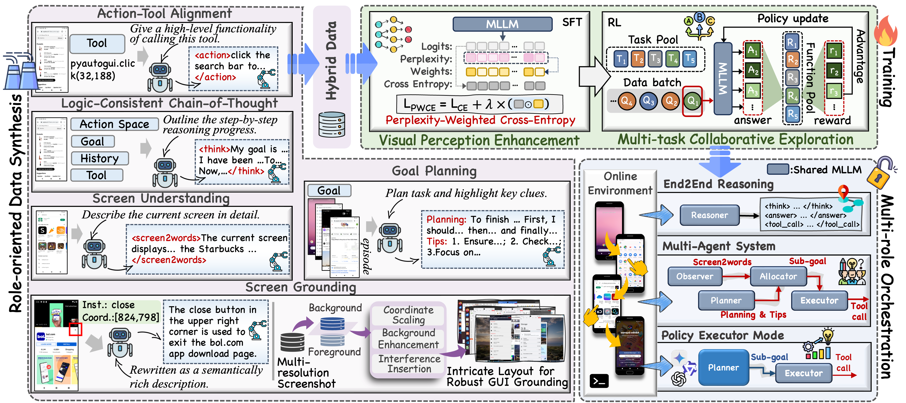

---
# Towards Scalable Lightweight GUI Agents via Multi-role Orchestration [](xxxx)

<div align="center">
  <i>Findings of ACL 2026</i>
</div>

<div align="center">
  
</div>

---

## Introduction

LAMO explores a new direction by cultivating the multi-role adaptation capabilities of lightweight MLLMs, enabling them to participate in realistic long-horizon GUI reasoning workflows through flexible orchestration.

This enables versatile inference modes—allowing a lightweight MLLM to function as an end-to-end monolithic agent, a coordinated MAS, or a plug-and-play executor paired with advanced planners—effectively expanding the capability boundaries of lightweight MLLMs in GUI automation.

Using LAMO, we train a native GUI agent LAMO-3B, which can be flexibly orchestrated into skill-specific roles for GUI-oriented tasks. When deployed as a policy executor and coordinated with advanced planners, LAMO-3B supports a higher performance ceiling for scalable GUI automation.

> For more details, please refer to the original paper.

---


### Model Weights

We provide the model weights for **LAMO-3B**:

- **LAMO-3B**: [DownLoad](https://huggingface.co/BigTaige/LAMO-3B)

### Environment Setup

We provide both `requirements.txt` and `environment.yml`.

```bash
# Clone the repository
git clone https://github.com/BigTaige/LAMO.git
cd LAMO
```

**Option A: Conda**

```bash
conda env create -f environment.yml
conda activate LAMO
```

**Option B: pip**

```bash
conda create -n LAMO python=3.10
conda activate LAMO
pip install -r requirements.txt
```
---
---
**ILG Data Augmentation Pipeline**
```bash
### Using the code below, you can synthesize large-scale, high-quality GUI grounding data at low cost based on existing datasets.
python ILG_data/ILG_data_synthesis_v1.py
```
We provide a subset of ILG data samples here for reference: [DownLoad](https://huggingface.co/datasets/BigTaige/ILG); please refer to the paper for details.

---
## Repository Structure

```text
.
├── LAMO-3B/              # model weights
├── ILG/                  # ILG data synthesis code
├── prompts.py            # instructions for data synthesis & multi-role orchestration
├── MAS_run.py            # MAS execution example
├── agent_run.py          # Planner-Executor hybrid execution example
├── requirements.txt      # pip dependencies
├── play.ipynb            # cookbook
└── environment.yml       # conda environment specification
```
---

**Model usage: vllm service**
```bash
### Deploy LAMO-3B using vLLM service.
nohup python -m vllm.entrypoints.openai.api_server --served-model-name Qwen2.5-VL-3B-Instruct --model ./LAMO-3B -tp 4 > running.log &
```
**Model usage: model loading**
```bash
from transformers import Qwen2_5_VLForConditionalGeneration, AutoProcessor
MAX_IMAGE_PIXELS = 10240*28*28
model = Qwen2_5_VLForConditionalGeneration.from_pretrained(
    "./LAMO-3B", 
    torch_dtype=torch.bfloat16, 
    attn_implementation="flash_attention_2", 
    device_map="auto"
)
processor = AutoProcessor.from_pretrained("./LAMO-3B", max_pixels=MAX_IMAGE_PIXELS, padding_side="left")
```

For more details on execution, please refer to the [HAR-GUI repository](https://github.com/BigTaige/HAR-GUI).

---

## Citation

```bibtex
Coming soon.
```
